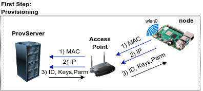

# Distributed Mutual Authentication

## Introduction

This code is the proof of concept of distributed mutual authentication without a certificate authority (CA).
For this purpose we used a pgp-based authentication system using [python gnupg](https://gnupg.readthedocs.io/en/0.4.7/#). 

The solution consists of two main steps:

The first step consists on the deployment and creation of the nodeID, certificates, and mesh parameters provisioning. This step is executed once, before the mission.

The second step is the authentication itself. This step can be executed multiple times, as many as new incomer nodes arrive.

##Installation 

It is necessary to execute the Docker environment.

`
cd mesh_com/modules/utils/docker
./start-docker.sh
`
Once the docker compiles go to the different steps

## Run Program
 
[Provisioning server](provServer/Readme.md)

[Node Authentication](nodeAu/Readme.md)